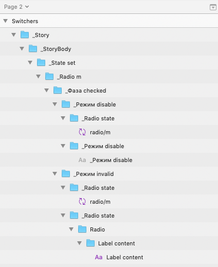

# Cleanup Taggeg Groups

As a result of the script [react-sketchapp](https://github.com/airbnb/react-sketchapp), deeply nested groups are formed. If using this script to create a ui-kit, it will be difficult for people to use it. With this plugin, can be removed extra levels.

This plugin cleans layer list in the whole document by ungrouping groups with special names. Special group name must start with a symbol 'low line' _.

Before | After 
 |  

